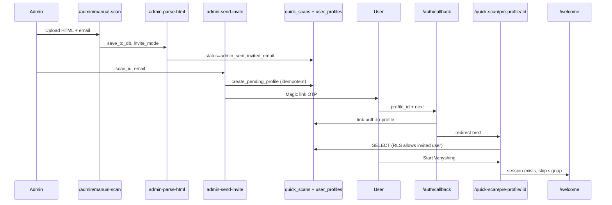

# Admin Invite Flow — Handoff Project Plan

**Codename:** `duct-tape-plan`  
**Repo:** `vanyshr-mono`  
**Branch:** `dev/admin-invite-flow` from `staging` (never `main`)  
**Goal:** Admin runs manual scan → enters email → user gets magic link → **authenticated** pre-profile → Start Vanyshing → `/welcome` (skip beta + `/signup`) → onboarding.

---

## 1. Executive summary

### Problem

Concierge onboarding: you run the scan and email results. The user should not discover themselves, should not hit public pre-profile, and should not repeat email signup after you already have their address.

### Solution (three layers)

1. **Data:** `quick_scans.status = 'admin_sent'` + `invited_email` + longer TTL for invites.
2. **Security:** RLS blocks anon reads on `admin_sent` rows; only invited authenticated user (or service role) can read `profile_data`.
3. **UX:** Admin sends invite → magic link → `/auth/callback?profile_id&next=pre-profile` → gated pre-profile → Start Vanyshing → `/welcome`.

### Non-goals (v1)

- Production admin RBAC (keep `DevOnly` wrapper on `/admin/manual-scan`).
- Skipping beta for non-admin public QuickScan (unchanged).
- Auto-resend / drip campaigns for abandoned invites.
- Changing `main` or merging to production.

---

## 2. Success criteria (acceptance tests)

| # | Scenario | Expected |
|---|----------|----------|
| A1 | Admin parses HTML + saves DB | Row: `status=admin_sent`, `invited_email` set, `profile_data` populated |
| A2 | Unauthenticated user opens `/quick-scan/pre-profile/{id}` for `admin_sent` | No exposure data; “Check your email” / resend affordance |
| A3 | Anon Supabase client `.from('quick_scans').select()` on `admin_sent` id | **0 rows** or policy error (not full `profile_data`) |
| A4 | Admin clicks “Send invite” | `create-pending-profile` once; OTP email sent; `pending_signup` + `converted_to_user_id` set |
| A5 | User clicks magic link (new email) | Session established; lands on pre-profile with full results |
| A6 | User clicks “Start Vanyshing” while authed | Navigates to `/welcome` — **no** BetaModal, **no** `/signup` |
| A7 | User completes welcome | Normal onboarding (`/onboarding/primary-info` etc.) |
| A8 | Public QuickScan pre-profile (`status=completed`) | Still works **without** auth (regression) |
| A9 | Admin re-sends invite for same scan | Same `profile_id` (idempotent), no duplicate `user_profiles` |
| A10 | User with existing Supabase account | Invite link still works with `profile_id` + `next` (no “Wrong Email?” dead end) |

---

## 3. Architecture



---

## 4. Data model changes

### 4.1 Migration file

**Path:** `supabase/migrations/YYYYMMDD_admin_invite_flow.sql`

```sql
-- 1) Expand status enum
ALTER TABLE quick_scans DROP CONSTRAINT IF EXISTS quick_scans_status_check;
ALTER TABLE quick_scans ADD CONSTRAINT quick_scans_status_check
  CHECK (status IN (
    'pending', 'scanning', 'matches_found', 'selection_required',
    'processing', 'completed', 'no_matches', 'failed', 'expired',
    'pending_signup', 'admin_sent'  -- NEW
  ));

-- 2) Invite recipient
ALTER TABLE quick_scans
  ADD COLUMN IF NOT EXISTS invited_email TEXT;

-- 3) Optional: audit timestamp
ALTER TABLE quick_scans
  ADD COLUMN IF NOT EXISTS invited_at TIMESTAMPTZ;

-- 4) Index for admin tooling
CREATE INDEX IF NOT EXISTS idx_quick_scans_admin_sent
  ON quick_scans (status) WHERE status = 'admin_sent';

-- 5) Extend TTL for invites (7 days) — set in app/edge, not default column
```

### 4.2 RLS policy overhaul (critical)

**Current (insecure for PII):** anon `SELECT` on all `quick_scans` with `USING (true)` (see `supabase/migrations/00003_core_schema.sql`).

**Target policies:**

| Role | `status != 'admin_sent'` | `status = 'admin_sent'` |
|------|--------------------------|-------------------------|
| `anon` | SELECT allowed (existing public flow) | **DENY** |
| `authenticated` | SELECT allowed | SELECT only if `lower(invited_email) = lower(auth.jwt() ->> 'email')` OR `converted_to_user_id` links to their profile |
| `service_role` | ALL | ALL |

**Implementation notes:**

- Drop/replace `"Allow select own session"` policy.
- Add `"Public quick scan read"` → `status IS DISTINCT FROM 'admin_sent'`.
- Add `"Admin invite scan read"` → `status = 'admin_sent' AND authenticated email match`.
- Keep insert/update policies for anon on non-admin rows OR restrict admin row updates to service role only after creation.

**Edge case:** After magic link, `link_auth_to_profile` sets `auth_user_id` on profile — email match policy should still work via `converted_to_user_id` once linked.

### 4.3 `create_pending_profile` idempotency

**File to replace:** Find the latest `create_pending_profile` definition (grep migrations; currently in `00012_scraper_source_tracking.sql`, may be superseded by `20260320_fix_pending_profile_status.sql` or later).

**Required behavior at start of function:**

```sql
-- If scan already has converted_to_user_id, return existing profile (do NOT insert again)
IF v_scan.converted_to_user_id IS NOT NULL THEN
  -- Optionally update email on profile if p_email provided and profile.email IS NULL
  RETURN jsonb_build_object(
    'success', true,
    'profile_id', v_scan.converted_to_user_id,
    'scan_id', p_scan_id,
    'existing', true
  );
END IF;
```

**Admin invite path:** When called from `admin-send-invite`, set `signup_status = 'admin_invited'` OR reuse `'pending_user'` and skip beta in frontend only.

**v1 recommendation:** add `'admin_invited'` to `user_profiles.signup_status` CHECK and use it in pre-profile to skip BetaModal.

### 4.4 Status transitions

| Event | `quick_scans.status` |
|-------|---------------------|
| Admin saves scan | `admin_sent` |
| `create_pending_profile` from invite | `pending_signup` |
| User views pre-profile (first authed load) | optional: stay `pending_signup` |
| `link_auth_to_profile` completes | `completed` (match existing link flow) |

Do **not** leave rows stuck at `admin_sent` after `create_pending_profile` — invite send should move to `pending_signup`.

---

## 5. Edge functions

### 5.1 Modify `admin-parse-html`

**Path:** `supabase/functions/admin-parse-html/index.ts`

| Change | Detail |
|--------|--------|
| Request body | Add `invite_mode?: boolean`, `invited_email?: string` |
| When `save_to_db && invite_mode` | `status: 'admin_sent'`, set `invited_email`, `expires_at: now + 7 days` |
| When `save_to_db && !invite_mode` | Keep `status: 'completed'` (dev preview link) |
| Response | Include `requires_auth: true` when `admin_sent` |

Register in `supabase/config.toml` if needed (mirror existing `admin-parse-html` entry).

### 5.2 NEW `admin-send-invite`

**Path:** `supabase/functions/admin-send-invite/index.ts`

**Auth:** Require `ADMIN_PARSE_SECRET` header (same as parse-html) OR service role from admin UI only.

**Input:**

```json
{ "scan_id": "uuid", "email": "user@example.com" }
```

**Steps:**

1. Validate scan exists, `status IN ('admin_sent', 'pending_signup')`, `profile_data` not null.
2. Normalize email lowercase → update `quick_scans.invited_email`.
3. Call `create_pending_profile(scan_id, email)` via service role RPC (idempotent).
4. Build redirect URL:

   ```
   {ORIGIN}/auth/callback?profile_id={profileId}&next=/quick-scan/pre-profile/{scanId}
   ```

5. Send OTP via Supabase Admin API:

   ```ts
   supabase.auth.admin.generateLink({
     type: 'magiclink',
     email,
     options: {
       redirectTo: redirectUrl,
       data: { profile_id, source_quick_scan_id: scan_id, flow: 'admin_invite' }
     }
   })
   ```

   **OR** `signInWithOtp` equivalent with service role if `generateLink` fits better.

6. Return `{ success: true, profile_id, message: 'Invite sent' }`.

**Config:** `verify_jwt = false` + secret header (same pattern as `admin-parse-html`).

**Env:** `SITE_URL` or derive from request origin header for redirect.

### 5.3 OPTIONAL `get-invite-pre-profile`

Only build if RLS email-JWT matching is unreliable in local dev.

**Input:** `{ scan_id }` — requires `Authorization: Bearer <user jwt>`  
**Logic:** Verify scan `admin_sent|pending_signup`, email match, return `{ profile_data, search_input }`.

**Prefer RLS-only for v1** to avoid extra surface area.

### 5.4 No changes required (verify only)

- `supabase/functions/create-pending-profile/index.ts` — passes through after RPC idempotency fix.
- `supabase/functions/link-auth-to-profile/index.ts` — ensure works when profile already has email.

---

## 6. Frontend changes

### 6.1 `apps/app/src/pages/admin/manual-scan.tsx`

**Add UI fields:**

- `invitedEmail` (required for invite flow)
- Checkbox: “Invite-only scan (requires magic link)” default **true**
- Button: **“Save & Send Invite”** (replaces or supplements “Parse & Save”)

**Submit flow:**

1. `admin-parse-html` with `invite_mode: true`, `invited_email`, `save_to_db: true`.
2. On success → call `admin-send-invite` with `scan_id`, `email`.
3. Show toast: “Invite sent to {email}” + copyable pre-profile URL (for support).
4. Remove or hide “Open pre-profile” for invite-only scans unless admin is logged in as that user (optional dev bypass).

**Secret:** Read `VITE_ADMIN_PARSE_SECRET` from env for `x-admin-secret` header (add to `apps/app/.env.local.example` only — never commit real secret).

### 6.2 `apps/app/src/pages/auth/callback.tsx`

**Change signup branch (when `profile_id` present):**

```ts
const next = params.get("next");
// ... link-auth-to-profile ...
if (next && next.startsWith("/")) {
  navigate(next, { replace: true });
} else {
  navigate("/welcome", { replace: true });
}
```

**Validate `next`:** allowlist paths starting with `/quick-scan/pre-profile/` only (prevent open redirect).

### 6.3 `apps/app/src/pages/scan/pre-profile.tsx`

**On mount (when `scanId` present):**

1. Fetch `status, invited_email, converted_to_user_id` (not just `profile_data`).
2. If `status === 'admin_sent'`:
   - `const { data: { session } } = await supabase.auth.getSession()`
   - No session → render `<AdminInviteGate scanId={scanId} emailHint={invited_email} />`.
   - Session → verify `session.user.email` matches `invited_email` (case-insensitive); mismatch → “Wrong account” + sign out button.
   - Then load `profile_data` (RLS should allow).
3. If `status !== 'admin_sent'` → existing load path unchanged.

**`handleStartVanyshing` branches:**

```ts
const { data: { session } } = await supabase.auth.getSession();
const profileId = sessionStorage.getItem("pendingProfileId")
  ?? /* from scan.converted_to_user_id via quick select */;

if (session && profileId) {
  // Verify link-auth already done (optional invoke link-auth-to-profile if auth_user_id null)
  navigate("/welcome", { replace: true });
  return;
}

// Existing: create-pending-profile + BetaModal for public flow
```

**Skip BetaModal when:**

- `signup_status === 'admin_invited'` OR scan was `pending_signup` with session present OR query param `?flow=admin_invite`.

### 6.4 NEW `AdminInviteGate` component

**Path:** `apps/app/src/components/AdminInviteGate.tsx`

Copy tone from `check-email.tsx`. Content:

- “Your privacy report is ready”
- “We sent a secure link to **{masked email}**”
- Button: “Resend link” → calls `admin-send-invite` (rate limit UI: disable 60s)

### 6.5 `apps/app/src/pages/auth/magic-link.tsx`

**No change for admin flow** (admin uses edge). Optional: support `?scan_id=` query for recovery.

### 6.6 `apps/app/src/components/BetaModal.tsx`

No change if pre-profile bypasses it entirely for admin invite.

### 6.7 Types / shared

Update any `QuickScanStatus` union type if it exists in `packages/` or app types.

---

## 7. Environment variables

| Variable | Where | Purpose |
|----------|-------|---------|
| `ADMIN_PARSE_SECRET` | Supabase secrets + `VITE_ADMIN_PARSE_SECRET` | Protect admin edge functions |
| `SITE_URL` | Supabase edge | Magic link redirect base (`https://app.vanyshr.com` prod, preview URL on Vercel) |
| Existing | `SUPABASE_SERVICE_ROLE_KEY` | Edge functions |

**Vercel preview:** `SITE_URL` must match preview domain for OTP redirect allowlist in Supabase Auth → URL Configuration.

---

## 8. Sub-agent orchestration (Haiku)

Use **one Opus orchestrator** + **6 Haiku workers**. Each Haiku prompt must include: branch name, read-only context files, exact deliverables, “do not touch” list, and PR-ready diff scope.

### Wave 0 — Orchestrator (Opus, no Haiku)

1. `git checkout staging && git pull && git checkout -b dev/admin-invite-flow`
2. Create empty migration file with section comments only.
3. This document is the source of truth.

### Wave 1 — Parallel Haiku (3 agents)

#### Haiku Agent A — Database

**Model:** Haiku  
**Owns:** `supabase/migrations/YYYYMMDD_admin_invite_flow.sql`

**Deliverables:**

- Status `admin_sent`, column `invited_email`, `invited_at`
- RLS policy replacement (section 4.2 exactly)
- `create_pending_profile` idempotency + `admin_invited` signup_status if approved in plan
- `GRANT` statements unchanged unless needed

**Do not touch:** frontend, edge functions.

**Verify:** `supabase db reset` locally; SQL test script in comments.

---

#### Haiku Agent B — Edge: parse + invite

**Model:** Haiku  
**Owns:**

- `supabase/functions/admin-parse-html/index.ts`
- `supabase/functions/admin-send-invite/index.ts` (new)
- `supabase/config.toml` entries

**Deliverables:**

- `invite_mode` + `invited_email` on parse
- Full `admin-send-invite` with secret header + generateLink/OTP
- CORS headers copy from sibling functions

**Do not touch:** migrations, frontend.

**Verify:** `curl` examples in function file comments.

---

#### Haiku Agent C — Auth callback + types

**Model:** Haiku  
**Owns:**

- `apps/app/src/pages/auth/callback.tsx`
- Any shared status types

**Deliverables:**

- `next` param with allowlist
- Unit-level comment documenting redirect matrix

**Do not touch:** pre-profile, manual-scan.

---

### Wave 2 — Parallel Haiku (2 agents, after Wave 1 merged)

#### Haiku Agent D — Pre-profile gate

**Model:** Haiku  
**Depends on:** Agent A migration applied locally

**Owns:**

- `apps/app/src/pages/scan/pre-profile.tsx`
- `apps/app/src/components/AdminInviteGate.tsx`

**Deliverables:**

- Auth gate for `admin_sent`
- Start Vanyshing → `/welcome` when session + profile exist
- Public flow regression preserved

---

#### Haiku Agent E — Admin UI

**Model:** Haiku  
**Depends on:** Agent B deployed locally

**Owns:**

- `apps/app/src/pages/admin/manual-scan.tsx`
- `.env.example` snippet if exists

**Deliverables:**

- Email field, invite mode, Send Invite button
- Wire headers with admin secret
- UX states: loading, success, error

---

### Wave 3 — Haiku Agent F — QA harness

**Model:** Haiku  
**Owns:** `docs/agent_documentation/admin-invite-test-plan.md`

**Deliverables:**

- Manual test checklist (section 9 below expanded)
- `curl` commands for edge functions
- Known Supabase dashboard settings (redirect URLs)

---

### Wave 4 — Orchestrator (Opus)

1. Merge conflicts, run `pnpm build` in `apps/app`.
2. Run migration on linked Supabase staging project.
3. Deploy edge functions: `supabase functions deploy admin-parse-html admin-send-invite`
4. Execute acceptance tests A1–A10.
5. Single commit: `feat: admin invite flow with gated pre-profile`

---

## 9. Manual test script

```bash
# From repo root
cd apps/app && pnpm dev
```

1. Set `VITE_ADMIN_PARSE_SECRET` + Supabase secrets to same value.
2. Open `/admin/manual-scan` (dev only).
3. Upload HTML, enter email, **Save & Send Invite**.
4. In incognito, open pre-profile URL **before** clicking email → must see gate, no PII.
5. Open magic link → pre-profile shows data.
6. Click Start Vanyshing → `/welcome` (not `/signup`).
7. In normal flow, run public quick-scan → pre-profile still public.

**DB verification:**

```sql
SELECT id, status, invited_email, converted_to_user_id
FROM quick_scans WHERE id = '<scan_id>';
```

---

## 10. File checklist

| Action | Path |
|--------|------|
| CREATE | `supabase/migrations/YYYYMMDD_admin_invite_flow.sql` |
| CREATE | `supabase/functions/admin-send-invite/index.ts` |
| MODIFY | `supabase/functions/admin-parse-html/index.ts` |
| MODIFY | `supabase/config.toml` |
| MODIFY | `apps/app/src/pages/admin/manual-scan.tsx` |
| MODIFY | `apps/app/src/pages/scan/pre-profile.tsx` |
| MODIFY | `apps/app/src/pages/auth/callback.tsx` |
| CREATE | `apps/app/src/components/AdminInviteGate.tsx` |
| OPTIONAL | `docs/agent_documentation/admin-invite-test-plan.md` |

---

## 11. Risks & mitigations

| Risk | Mitigation |
|------|------------|
| Open redirect via `next` | Allowlist `/quick-scan/pre-profile/` prefix only |
| PII leak via anon RLS | Agent A must add automated SQL test; Agent F verifies incognito |
| Duplicate profiles | Idempotent `create_pending_profile` |
| OTP redirect blocked | Add preview + prod URLs in Supabase Auth settings |
| `signup_status` still `pending_auth` in old RPC body | Grep latest migration; Agent A uses `pending_user` or `admin_invited` |
| Existing user email on invite | `admin-send-invite` uses `generateLink` with `profile_id` in redirect, not signup pre-flight |
| 30-min TTL expires | Set 7-day `expires_at` on admin_sent rows |
| Beta modal still shows | Pre-profile branch skips modal when session exists |

---

## 12. Implementation order (single-threaded fallback)

If not using sub-agents:

1. Migration + RLS
2. `create_pending_profile` idempotency
3. `admin-parse-html` invite_mode
4. `admin-send-invite`
5. `callback.tsx` next param
6. `pre-profile.tsx` + `AdminInviteGate`
7. `manual-scan.tsx`
8. E2E manual tests
9. Commit on `dev/admin-invite-flow`

---

## 13. Commit & deploy

```bash
git checkout staging
git pull
git checkout -b dev/admin-invite-flow
# ... work ...
git add supabase/ apps/app/
git commit -m "$(cat <<'EOF'
feat: admin invite flow with auth-gated pre-profile

Admin manual scans can invite users by email; magic link lands on
gated pre-profile then welcome without signup.
EOF
)"
git push -u origin dev/admin-invite-flow
```

**Supabase:** `supabase db push` (staging project) + deploy both edge functions.  
**Do not merge to `main`** unless explicitly instructed.

---

## 14. Key reference files (existing codebase)

| Area | Path |
|------|------|
| Routes | `apps/app/src/App.tsx` |
| Pre-profile | `apps/app/src/pages/scan/pre-profile.tsx` |
| Auth callback | `apps/app/src/pages/auth/callback.tsx` |
| Signup magic link | `apps/app/src/pages/auth/magic-link.tsx` |
| Admin manual scan | `apps/app/src/pages/admin/manual-scan.tsx` |
| Beta gate | `apps/app/src/components/BetaModal.tsx` |
| Parse HTML edge | `supabase/functions/admin-parse-html/index.ts` |
| Create profile edge | `supabase/functions/create-pending-profile/index.ts` |
| Link auth edge | `supabase/functions/link-auth-to-profile/index.ts` |
| quick_scans schema | `supabase/migrations/00003_core_schema.sql`, `00005_profile_schema_update.sql` |
| Git workflow | `CLAUDE.md`, `docs/CICD.md` |

---

## 15. Next step

Use the **Opus 4.7 master prompt** (separate doc) that references this file as source of truth, enforces wave order + Haiku delegation, and requires test evidence before merge.
