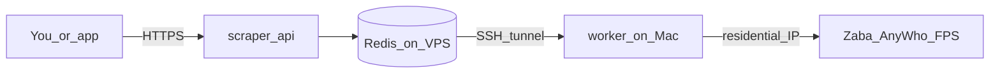

# Home residential worker (pilot)

Use your **home IP** for scrapes while keeping the public API and queue on the VPS.



## One-time VPS changes

Redis is bound to `127.0.0.1:6379` on the VPS (not public). Stop the datacenter worker so only home processes jobs:

```bash
ssh deploy@178.156.171.112
cd /opt/vanyshr/scraper-lab
docker compose pull
docker compose up -d redis scraper-api
docker compose --profile datacenter stop scraper-worker 2>/dev/null || docker compose stop scraper-worker
```

After pulling updates that add the `datacenter` profile, the VPS worker will not restart unless you run `docker compose --profile datacenter up -d`.

## Home Mac setup

1. Install Deno if needed: https://docs.deno.com/runtime/getting_started/installation/

2. Copy env file:

```bash
cd /path/to/vanyshr-scraper-lab
cp config/env/.env.home.example config/env/.env.home
```

3. **Terminal A** — Redis tunnel (leave running):

```bash
chmod +x scripts/home-redis-tunnel.sh
./scripts/home-redis-tunnel.sh
```

4. **Terminal B** — worker:

```bash
chmod +x scripts/run-home-worker.sh
./scripts/run-home-worker.sh
```

You should see: `scraper-worker started (egress=home)`

## Test (same as before)

Submit jobs to the VPS API; the **home** worker drains the queue:

```bash
export SCRAPER_TOKEN='from VPS config/env/.env'

curl -sS -X POST https://scraper-lab.vanyshr.com/v1/quickscan/search \
  -H "Authorization: Bearer $SCRAPER_TOKEN" \
  -H "Content-Type: application/json" \
  -d '{"first_name":"James","last_name":"Oehring","city":"Cameron","state":"MO"}'
```

Poll `/v1/jobs/{id}` — sources default to `zabasearch`, `anywho`, and `fastpeoplesearch` (direct fetch from home IP).

Set in `config/env/.env.home`:

```bash
SCRAPER_DEFAULT_SOURCES=zabasearch,anywho,fastpeoplesearch
```

**FastPeopleSearch** on home: plain `fetch()` often gets Cloudflare **403**. The worker then runs **nodriver** (real Chrome — same as `scripts/fps_nodriver_smoke.py`). This is on by default for home egress:

```bash
FPS_USE_NODRIVER=true
```

Requires `pip install nodriver` and a Chromium binary. **Google Chrome for Testing** works (you do not need regular Chrome). Add to `.env.home`:

```bash
CHROME_FOR_TESTING_BIN=/full/path/to/Google Chrome for Testing.app/Contents/MacOS/Google Chrome for Testing
```

Find it:

```bash
mdfind "kMDItemFSName == 'Google Chrome for Testing' && kMDItemContentType == public.unix-executable'"
```

First FPS job may take ~30–90s while the browser solves CF.

Optional alternate: stealth-browser skill (`FPS_USE_STEALTH_BROWSER=true`).

## Pilot notes

- Mac must stay awake and on your home network; jobs queue in Redis if the worker is down.
- Do **not** run the VPS `scraper-worker` at the same time (race on the same queue).
- When you outgrow home egress, add a residential proxy and run the worker on the VPS again (or hybrid).

## Optional: keep tunnel alive

```bash
brew install autossh
autossh -M 0 -N -o ServerAliveInterval=30 -L 6379:127.0.0.1:6379 deploy@178.156.171.112
```
