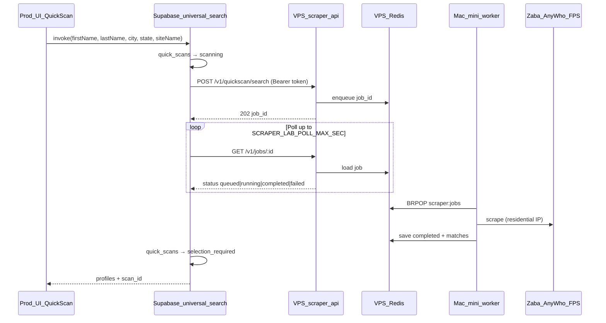

# VPS + Home Worker → Prod QuickScan Duct-Tape Plan

**Purpose:** Handoff document for Claude Code (orchestrator: Opus 4.7) to wire production Vanyshr QuickScan through the scraper-lab stack with **residential egress on a Mac mini**, without rewriting the prod UI or merging repos.

**Pilot deadline context:** Investor demo. Prefer **working AnyWho + Zabasearch** over perfect FPS on first screen.

**Status as of plan authorship:** Partial implementation may already exist in `vanyshr-mono` (`scraper-lab-client.ts` + `universal-search` branch). Treat as **verify → harden → deploy → prove**, not greenfield.

---

## 1. Success criteria (definition of done)

| # | Criterion | How to verify |
|---|-----------|---------------|
| 1 | Prod QuickScan first submit returns real AnyWho matches | Live app or `supabase functions invoke` with known person |
| 2 | Zaba runs on profile select / “none of these” when enabled by UI | Second `universal-search` call with `siteName: Zabasearch` |
| 3 | Edge function logs show `🏠 Using scraper-lab` when secrets set | Supabase Dashboard → Functions → Logs |
| 4 | Mac mini worker drains jobs (not VPS worker) | Worker terminal shows `job … completed`; VPS worker stopped |
| 5 | `quick_scans` rows update: `scanning` → `selection_required` / `no_matches` / `scraper_failed` | Prod DB or admin tools |
| 6 | Rollback works: unset secrets → datacenter in-process scrapers | Same invoke, logs show `🔍 Searching single scraper` |
| 7 | Doc exists for ops handoff | `vanyshr-mono/docs/SCRAPER_LAB_DUCT_TAPE.md` |

**Explicit non-goals for this plan:**

- FPS on first QuickScan screen (edge timeout + 30–90s nodriver)
- Async job polling in React UI
- Residential proxy on VPS
- Merging `vanyshr-scraper-lab` into `vanyshr-mono`
- Committing secrets (`.env.home`, tokens)

---

## 2. Architecture



**Traffic paths:**

| Path | Carries | Does NOT carry |
|------|---------|----------------|
| User → `app.vanyshr.com` | Normal HTTPS to Supabase + UI | Scraper traffic |
| Edge → `https://scraper-lab.vanyshr.com` | Job create + poll | Residential IP |
| SSH tunnel Mac → VPS | Redis protocol to `127.0.0.1:6379` | HTTP scrape egress |
| Mac worker → broker sites | Full scrape | — |

**Single-consumer rule:** Only **one** process may run `apps/scraper-worker` against `scraper:jobs`. For pilot: **Mac mini only**; VPS `scraper-worker` must be **stopped**.

---

## 3. Inventory (repos, hosts, URLs)

### 3.1 Repos

| Repo | Path (local example) | Role |
|------|----------------------|------|
| `vanyshr-scraper-lab` | `…/vanyshr-scraper-lab` | API, Redis queue, home worker, FPS nodriver |
| `vanyshr-mono` | `…/vanyshr-mono` | Prod app + Supabase edge `universal-search` |

### 3.2 Infrastructure

| Component | Location | Notes |
|-----------|----------|-------|
| VPS | `deploy@178.156.171.112`, Ubuntu 24.04 | Repo: `/opt/vanyshr/scraper-lab` |
| Public API | `https://scraper-lab.vanyshr.com` | Caddy → `scraper-api:8080` |
| Redis | VPS `127.0.0.1:6379` | Bound locally; reached from home via SSH `-L 6379:127.0.0.1:6379` |
| Home worker | Mac mini (was MacBook) | `scripts/home-redis-tunnel.sh` + `scripts/run-home-worker.sh` |
| Prod Supabase | Existing project (do not create new) | Same `quick_scans` table |

### 3.3 Key files (read before coding)

**vanyshr-scraper-lab**

| File | Purpose |
|------|---------|
| `apps/scraper-api/main.ts` | `POST /v1/quickscan/search`, `GET /v1/jobs/:id`, `/health` |
| `apps/scraper-worker/main.ts` | Queue consumer |
| `apps/scraper-worker/src/runner/quickscan-runner.ts` | Multi-source search |
| `apps/scraper-worker/src/sources/*.ts` | Scrapers; `name` = `AnyWho`, `Zabasearch`, `FastPeopleSearch` |
| `packages/queue/src/jobs.ts` | `QuickScanJobRecord`, Redis keys |
| `packages/contracts/src/quickscan.ts` | Zod input/match schemas |
| `scripts/test-quickscan.sh` | End-to-end API smoke |
| `deploy/HOME_WORKER.md` | Mac setup |
| `deploy/RUNBOOK.md` | VPS deploy |
| `config/env/.env.home.example` | Home worker env template |

**vanyshr-mono**

| File | Purpose |
|------|---------|
| `supabase/functions/universal-search/index.ts` | Prod search orchestration + `quick_scans` writes |
| `supabase/functions/_shared/scraper-lab-client.ts` | Bridge (may exist) |
| `supabase/functions/_shared/scrapers/` | Datacenter fallback scrapers |
| `packages/ui/src/components/application/quick-scan-form.tsx` | **Do not change** for pilot unless fixing a blocking bug |

---

## 4. API contract (canonical)

Orchestrator and sub-agents must treat this as source of truth. If implementation diverges, **fix the bridge** in mono unless the bug is in scraper-lab.

### 4.1 Auth

- Header: `Authorization: Bearer $SCRAPER_TOKEN`
- Alternate: `x-scraper-token: $SCRAPER_TOKEN`
- VPS token lives in `/opt/vanyshr/scraper-lab/config/env/.env` as `SCRAPER_TOKEN`
- Supabase secret `SCRAPER_LAB_TOKEN` must be **identical**

### 4.2 Create job

`POST https://scraper-lab.vanyshr.com/v1/quickscan/search`

Request body:

```json
{
  "first_name": "James",
  "last_name": "Oehring",
  "city": "Cameron",
  "state": "MO",
  "zip": "64429",
  "sources": ["anywho"]
}
```

- `sources` optional; API default from `SCRAPER_DEFAULT_SOURCES` (VPS docker env often all three — **bridge must pass explicit `sources` per UI call**).
- Response `202`: `{ "job_id": "<uuid>", "status": "queued" }`

### 4.3 Poll job

`GET https://scraper-lab.vanyshr.com/v1/jobs/:job_id`

Response shape (`QuickScanJobRecord`):

```json
{
  "id": "uuid",
  "status": "queued|running|completed|failed",
  "input": { "first_name": "...", "last_name": "...", "city": "...", "state": "..." },
  "sources": ["anywho"],
  "created_at": "ISO",
  "updated_at": "ISO",
  "outcome": "success|blocked|no_results|transport_error|parser_error",
  "matches": [
    {
      "id": "aw-1",
      "name": "James Oehring",
      "age": "42",
      "city_state": "Cameron, MO",
      "phone_snippet": "(***) ***-1234",
      "detail_link": "https://...",
      "source": "AnyWho",
      "fullProfile": {}
    }
  ],
  "runs": [
    {
      "scraper": "anywho",
      "status": "success|no_results|blocked|failed",
      "profiles_found": 3,
      "duration_ms": 12000,
      "error": null
    }
  ],
  "error": "only when status=failed"
}
```

### 4.4 Bridge mapping (mono → prod UI)

| scraper-lab | `universal-search` / UI |
|-------------|-------------------------|
| `matches[].source` | Normalize to `AnyWho`, `Zabasearch`, `FastPeopleSearch` |
| `runs[].status === "success"` | `scraperRuns[].success = true` |
| `runs[].profiles_found` | `scraperRuns[].matchCount` |
| `matches` | `candidate_matches` + response `profiles` |

**siteName → sources** (one source per prod UI call today):

| UI `siteName` | Bridge `sources` |
|---------------|------------------|
| `AnyWho` | `["anywho"]` |
| `Zabasearch` | `["zabasearch"]` |
| `search_all` true | all name scrapers — **avoid in prod UI for pilot** |

---

## 5. Prod UI behavior (frozen for pilot)

From `quick-scan-form.tsx`:

1. **First submit:** `siteName: "AnyWho"` only (+ city/state from zip lookup).
2. **On profile select:** may call Zaba with `scan_id` if profile not from AnyWho.
3. **“None of these”:** Zaba with `scan_id`.
4. **Warm-up:** `ping: true` on mount (no scrape).

**Implication for bridge:** Each edge invocation should request **one** source, not API defaults (`zabasearch,anywho,fastpeoplesearch`). Confirm `siteNamesToSources()` receives a one-element list.

**Timing budget:**

| Step | Expected duration (home) | Edge poll default |
|------|--------------------------|-------------------|
| AnyWho only | ~15–45s | 150s max OK |
| Zaba only | ~15–45s | 150s max OK |
| FPS (nodriver) | 30–90s+ | Do not enable on first screen |

Supabase Edge Functions wall clock is typically **~150s** on paid tiers — do not chain three slow sources in one invoke.

---

## 6. Work breakdown & sub-agent assignments

**Orchestrator (Opus 4.7):** Run phases in order; merge sub-agent outputs; run final GO/NO-GO.

**Sub-agents:** Use **Claude Haiku** for read-heavy / bounded tasks below. Each sub-agent gets: repo path, read-only vs write scope, exact deliverable, and “stop conditions”.

### Phase 0 — Preflight (Orchestrator, no sub-agent)

```bash
# scraper-lab
curl -sS https://scraper-lab.vanyshr.com/health

# mono — confirm bridge files exist
test -f supabase/functions/_shared/scraper-lab-client.ts
test -f supabase/functions/universal-search/index.ts
```

Deliverable: 5-line status note — VPS health, whether bridge files exist, git branch names.

---

### Phase 1 — Sub-agent **HAIKU-A** (scraper-lab contract audit)

**Model:** Haiku  
**Repo:** `vanyshr-scraper-lab` only  
**Write:** None (audit only) unless a one-line doc fix is clearly wrong  

**Tasks:**

1. Confirm `GET /v1/jobs/:id` returns all fields in §4.3.
2. Confirm scraper `name` fields: `AnyWho`, `Zabasearch`, `FastPeopleSearch` in `anywho.ts`, `zabasearch.ts`, `fastpeoplesearch.ts`.
3. Confirm `runs[].status` values match what `scraper-lab-client.ts` expects (`success` boolean mapping).
4. Run or document `scripts/test-quickscan.sh` expected output for James Oehring / Cameron MO.
5. List any mismatch between `ProfileMatch` in worker `BaseScraper.ts` and `packages/contracts/src/quickscan.ts`.

**Deliverable:** `audit-scraper-lab.md` (≤80 lines) with PASS/FAIL per check and exact file:line references for failures.

**Stop:** Do not change scraper logic unless orchestrator approves after reading audit.

---

### Phase 2 — Sub-agent **HAIKU-B** (mono bridge audit + harden)

**Model:** Haiku  
**Repo:** `vanyshr-mono` only  
**Write:** Allowed in:
- `supabase/functions/_shared/scraper-lab-client.ts`
- `supabase/functions/universal-search/index.ts`
- `docs/SCRAPER_LAB_DUCT_TAPE.md` (create)

**Tasks:**

1. Read existing `scraper-lab-client.ts` and `universal-search/index.ts`.
2. Verify `scraperLabEnabled()` gates on `SCRAPER_LAB_URL` + `SCRAPER_LAB_TOKEN`.
3. Verify single-source calls: `siteName: AnyWho` → POST body `sources: ["anywho"]` only.
4. Verify `mapMatches()` source labels match UI (`AnyWho`, `Zabasearch`, `FastPeopleSearch`).
5. Verify `runs` mapping: `success: r.status === "success"`.
6. Verify `quick_scans` update path unchanged (status, `candidate_matches`, `scraper_runs`).
7. On scraper-lab exception: `scraper_failed` when appropriate; do not throw uncaught 500 if avoidable.
8. **Optional hardening (if ≤30 min):** If job `outcome === "blocked"` and zero matches, set `scraper_failed` semantics consistent with datacenter path.
9. Write `docs/SCRAPER_LAB_DUCT_TAPE.md` with secrets list, deploy commands, rollback, Mac mini pointer to `vanyshr-scraper-lab/deploy/HOME_WORKER.md`.

**Explicitly do NOT:**

- Edit `quick-scan-form.tsx`
- Add FPS to first scan
- Commit secrets

**Deliverable:** PR-ready diff + doc + short test plan (invoke examples).

---

### Phase 3 — Sub-agent **HAIKU-C** (ops runbook + env matrix)

**Model:** Haiku  
**Repos:** `vanyshr-scraper-lab` docs only  
**Write:** Allowed:
- `deploy/HOME_WORKER.md` (minor: Mac mini wording)
- `deploy/vps-duct-tape-plan.md` §10 checklist only if orchestrator requests
- Optional: `scripts/verify-duct-tape.sh` (new, non-secret)

**Tasks:**

1. Produce copy-paste blocks for:
   - VPS: ensure `redis` + `scraper-api` up; **stop** datacenter worker
   - Supabase secrets + `supabase functions deploy universal-search`
   - Mac mini: tunnel + worker + `test-quickscan.sh`
2. Env matrix table:

| Variable | Where set | Value source |
|----------|-----------|--------------|
| `SCRAPER_TOKEN` | VPS `.env`, `.env.home`, Supabase `SCRAPER_LAB_TOKEN` | Same string |
| `SCRAPER_LAB_URL` | Supabase secret | `https://scraper-lab.vanyshr.com` |
| `SCRAPER_LAB_POLL_MAX_SEC` | Supabase secret | `150` (default) |
| `SCRAPER_LAB_POLL_MS` | Supabase secret | `2000` |
| `CHROME_FOR_TESTING_BIN` | `.env.home` on Mac | Absolute path, quoted if spaces |
| `REDIS_URL` | `.env.home` | `redis://127.0.0.1:6379` |

3. Document **Mac mini migration** from MacBook: copy `.env.home`, update Chrome path via `mdfind`.

**Deliverable:** Ops section ready to paste into `SCRAPER_LAB_DUCT_TAPE.md` (orchestrator merges).

---

### Phase 4 — Sub-agent **HAIKU-D** (verification script)

**Model:** Haiku  
**Repo:** `vanyshr-scraper-lab`  
**Write:** `scripts/verify-duct-tape.sh` (optional but recommended)

**Script behavior:**

1. `curl /health` — fail if not `redis: ok`
2. POST quickscan with `sources: ["anywho"]` — capture `job_id`
3. Poll until complete or 150s
4. Exit 0 if `status=completed` and `matches.length >= 0` with `runs[0].status` logged
5. Print human-readable GO/NO-GO

No secrets in repo — read `SCRAPER_TOKEN` from `config/env/.env.home` like `test-quickscan.sh`.

**Deliverable:** Script + example successful stdout.

---

### Phase 5 — Orchestrator integration & deploy

**Owner:** Opus 4.7 (not Haiku)

1. Merge Haiku-B code + docs.
2. Merge Haiku-C ops into final doc.
3. User executes deploy (or orchestrator with explicit permission):
   ```bash
   cd vanyshr-mono
   supabase secrets set \
     SCRAPER_LAB_URL="https://scraper-lab.vanyshr.com" \
     SCRAPER_LAB_TOKEN="<from VPS>" \
     SCRAPER_LAB_POLL_MAX_SEC="150"
   supabase functions deploy universal-search
   ```
4. User ensures Mac mini tunnel + worker running.
5. Run `verify-duct-tape.sh` then prod UI test.

---

## 7. Implementation details (orchestrator reference)

### 7.1 Existing bridge behavior (verify, don’t rewrite blindly)

`scraper-lab-client.ts` (expected):

- `scraperLabEnabled()` → both env vars set
- `siteNamesToSources()` maps zaba/anywho/fast
- Poll loop with `SCRAPER_LAB_POLL_MAX_SEC` / `SCRAPER_LAB_POLL_MS`
- `mapMatches()` + `normalizeSourceLabel()`

`universal-search/index.ts` (expected):

```typescript
if (scraperLabEnabled()) {
  const siteList = search_all ? [...] : [scraperName];
  const result = await searchViaScraperLab(siteList, searchInput);
  // sets matches, scraperRuns
}
```

### 7.2 Known gaps to check

| Gap | Risk | Fix |
|-----|------|-----|
| Bridge omits `sources` → API runs all 3 | Edge timeout, FPS nodriver in first call | Always pass explicit `sources` from `siteNames` |
| `zip` in UI not in `searchInput` | Minor — city/state usually enough | Add `zip: zipCode` to `searchInput` if trivial |
| scraper-lab error swallowed, empty matches | UI shows `no_matches` not retry | Ensure `scraper_failed` when `scraperRuns[].success === false` |
| VPS worker still running | Random job consumer, flaky results | SSH stop datacenter profile |
| Tunnel down | Jobs stuck `queued` | Monitor Redis queue / worker logs |
| Token mismatch | 401 on create/poll | Align all three token locations |

### 7.3 Datacenter fallback

When `SCRAPER_LAB_URL` or `SCRAPER_LAB_TOKEN` unset, `universal-search` must use existing `searchProfiles` / `searchProfilesMulti` — **no behavior change** for local dev without secrets.

Optional post-pilot: on scraper-lab timeout, fall back to datacenter (feature flag) — **out of scope** unless demo day requires it.

---

## 8. Deployment runbook (human or orchestrator)

### 8.1 VPS (one-time / after pull)

```bash
ssh deploy@178.156.171.112
cd /opt/vanyshr/scraper-lab
git pull
docker compose pull
docker compose up -d redis scraper-api
docker compose --profile datacenter stop scraper-worker 2>/dev/null || true
curl -sS https://scraper-lab.vanyshr.com/health
```

### 8.2 Mac mini (before demo)

Terminal A:

```bash
cd /path/to/vanyshr-scraper-lab
./scripts/home-redis-tunnel.sh
```

Terminal B:

```bash
cd /path/to/vanyshr-scraper-lab
# config/env/.env.home present with SCRAPER_TOKEN, CHROME_FOR_TESTING_BIN, etc.
./scripts/run-home-worker.sh
```

Smoke:

```bash
./scripts/test-quickscan.sh James Oehring Cameron MO
# For duct-tape-aligned test, use verify-duct-tape.sh with sources anywho only once added
```

System: disable sleep, stable network, keep terminals open (or `autossh` per `HOME_WORKER.md`).

### 8.3 Supabase (prod)

```bash
cd /path/to/vanyshr-mono
supabase link   # if not already
supabase secrets set \
  SCRAPER_LAB_URL="https://scraper-lab.vanyshr.com" \
  SCRAPER_LAB_TOKEN="REPLACE_WITH_VPS_SCRAPER_TOKEN" \
  SCRAPER_LAB_POLL_MAX_SEC="150" \
  SCRAPER_LAB_POLL_MS="2000"
supabase functions deploy universal-search
```

### 8.4 Rollback (instant)

```bash
supabase secrets unset SCRAPER_LAB_URL SCRAPER_LAB_TOKEN
# or set SCRAPER_LAB_URL="" if unset unsupported
supabase functions deploy universal-search
```

Prod returns to datacenter edge scrapers.

---

## 9. End-to-end test plan

### 9.1 Layer tests (bottom-up)

| Layer | Command / action | Pass |
|-------|------------------|------|
| L1 Health | `curl https://scraper-lab.vanyshr.com/health` | `"redis":"ok"` |
| L2 API + worker | `./scripts/test-quickscan.sh` on Mac | `status: completed`, matches present |
| L3 Single-source | POST `sources:["anywho"]` only | AnyWho matches, run status success |
| L4 Edge | `supabase functions invoke universal-search --body '{...,"siteName":"AnyWho"}'` | `profiles.length > 0`, log 🏠 |
| L5 UI | Prod QuickScan known person | Modals show candidates |

### 9.2 Golden test persona

- **Name:** James Oehring  
- **Location:** Cameron, MO (zip validates to city/state in UI)  
- Expect: AnyWho candidates on first scan; Zaba on second step when triggered

### 9.3 Failure modes to rehearse

| Symptom | Likely cause | Fix |
|---------|--------------|-----|
| Jobs stay `queued` | Tunnel down or worker not running | Start tunnel + worker |
| 401 from API | Token mismatch | Sync secrets |
| Edge timeout | Too many sources / FPS | Single-source per invoke |
| `scraper_failed` both retries | Home IP blocked or worker crash | Check worker logs, `./scripts/test-quickscan.sh` |
| Wrong consumer | VPS + home workers | Stop VPS worker |

---

## 10. GO / NO-GO checklist (demo day)

Print and check:

- [ ] `https://scraper-lab.vanyshr.com/health` OK
- [ ] VPS `scraper-worker` **stopped**
- [ ] Mac mini tunnel up (Terminal A)
- [ ] Mac mini worker up — log line `scraper-worker started (egress=home)`
- [ ] `./scripts/test-quickscan.sh` completed successfully in last 30 min
- [ ] Supabase secrets `SCRAPER_LAB_*` set
- [ ] `universal-search` deployed after secret change
- [ ] Supabase logs show 🏠 on test invoke
- [ ] Prod UI QuickScan tested once end-to-end
- [ ] Rollback command known (unset secrets)

---

## 11. Risks & mitigations

| Risk | Impact | Mitigation |
|------|--------|------------|
| Mac sleeps / network drop | Failed demo | `caffeinate`, wired Ethernet, autossh |
| Edge 150s timeout | Hung UI | One source per call; no FPS on first screen |
| Dual workers | Nondeterministic | Stop VPS worker |
| Cloudflare on FPS | Slow/fail | Out of scope for first screen |
| Partial bridge already merged | Rework | Phase 1–2 audit first |
| `fullProfile` not in UI path | Less enrichment on select | Accept for pilot; Zaba merge path still works when present |

---

## 12. Post-pilot backlog (do not implement in duct-tape PR)

1. UI async polling (submit → job id → poll) for multi-source + FPS
2. Map scraper-lab `fullProfile` into `quick_scans.profile_data` on select
3. Residential proxy on VPS; re-enable datacenter worker
4. Datacenter fallback on scraper-lab timeout (feature flag)
5. Launchd/`brew services` for tunnel + worker on Mac mini

---

## 13. Prompt shell for Opus 4.7 (after this plan)

When the user asks for the execution prompt, generate a single message that:

1. References this file path: `vanyshr-scraper-lab/deploy/vps-duct-tape-plan.md`
2. Orders: Phase 0 → spawn Haiku A/B/C/D in parallel where possible → Phase 5 deploy → §10 checklist
3. Forbids scope creep in §12
4. Outputs final GO/NO-GO with copy-paste commands only in fenced `bash` blocks

---

## 14. Document history

| Date | Author | Note |
|------|--------|------|
| 2026-05-16 | Cursor agent | Initial plan from live codebase + pilot context |
